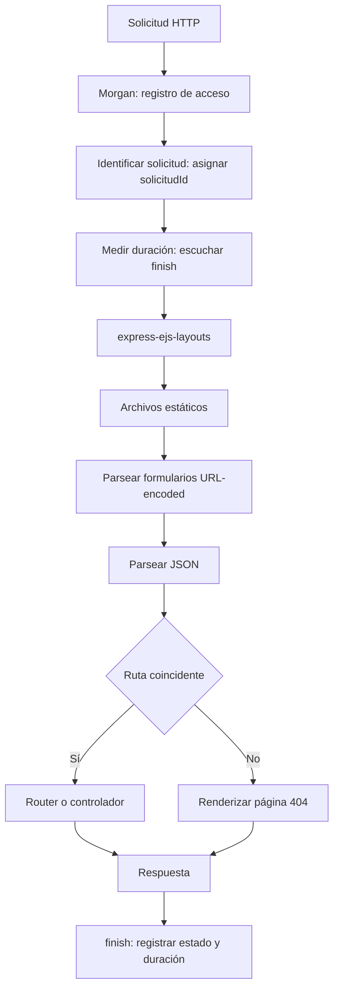
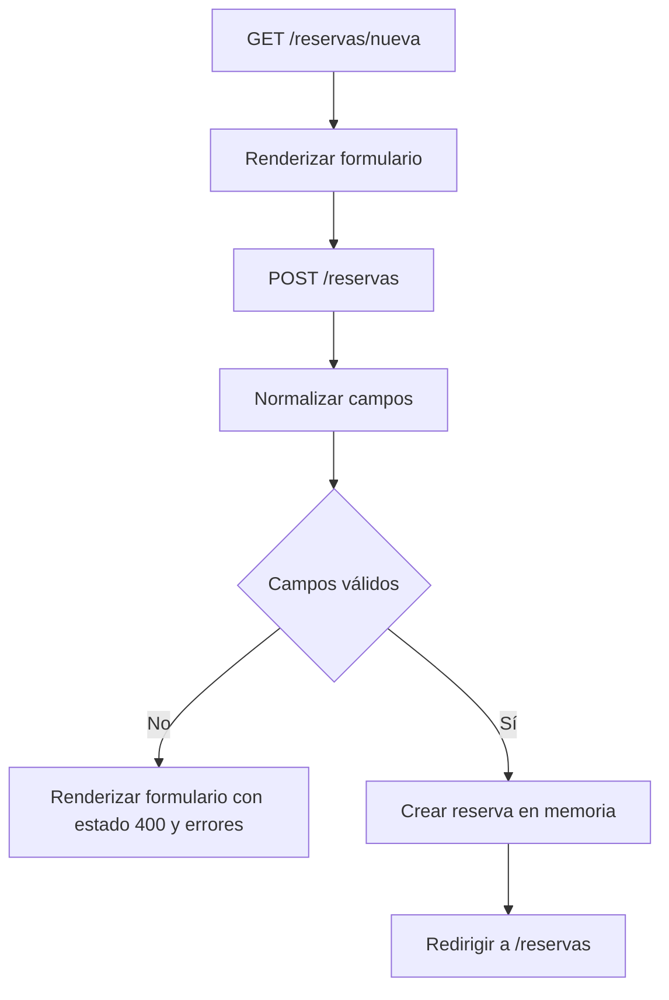

# TP5: Pipeline de middleware en Express

## Descripción

Aplicación web para consultar salas de estudio y registrar reservas temporales. El proyecto muestra el orden y el alcance de middleware en Express, el renderizado de vistas EJS y el procesamiento de formularios.

## Tecnologías y requisitos

- Node.js 18 o superior
- npm
- Express, EJS, `express-ejs-layouts` y Morgan

## Instalación y ejecución

Desde la carpeta del proyecto, instala las dependencias y arranca el servidor:

```bash
npm install
npm start
```

Abre <http://localhost:3000>. El servidor utiliza el puerto `3000`.

Para comprobar la sintaxis del archivo principal:

```bash
npm run check
```

## Rutas disponibles

| Método | Ruta | Resultado |
| --- | --- | --- |
| GET | `/` | Página de inicio |
| GET | `/estado` | Estado del servicio, cantidad de reservas e ID de solicitud |
| GET | `/reservas` | Listado de reservas; muestra un estado vacío cuando no hay elementos |
| GET | `/reservas/nueva` | Formulario de alta |
| POST | `/reservas` | Valida y registra una reserva; ante éxito redirige al listado |
| GET | `/reservas/:id` | Detalle de una reserva o página 404 si no existe |
| Cualquier otro método/ruta | — | Página 404 |

## Pipeline de middleware

El ID se asigna antes de medir la solicitud. La duración se registra al emitir la respuesta `finish`, por lo que incluye el tiempo hasta que la respuesta termina de enviarse.



## Flujo de alta de una reserva

Los campos se normalizan antes de validarse. Si hay errores, se responde con estado `400` y se vuelven a mostrar los valores normalizados; si son válidos, se guarda la reserva y se aplica el patrón POST/Redirect/GET.



## Validaciones del formulario

- Estudiante, correo, sala, fecha y turno son obligatorios.
- El correo debe contener `@`.
- La sala debe ser una de las opciones permitidas: Sala Norte, Sala Sur o Sala Multimedia.
- La fecha debe tener formato `AAAA-MM-DD` y corresponder a una fecha real.
- El turno debe ser Mañana, Tarde o Noche.
- La cantidad de personas debe ser un entero entre 1 y 6, inclusive.
- Los errores se muestran en un elemento con `role="alert"`.

## Vistas y accesibilidad

Las vistas EJS están en `views/`. El layout `views/layouts/main.ejs` contiene la navegación y el ID de solicitud. El formulario asocia etiquetas con sus controles y el listado informa cuando todavía no hay reservas.

## Datos y middleware

Las reservas de ejemplo y las nuevas se mantienen en memoria; se reinician al detener el proceso. `solicitudId` se asigna mediante `res.locals` para que esté disponible en las vistas y en el endpoint `/estado`. Morgan registra las solicitudes y el middleware de duración informa método, URL, estado y milisegundos al finalizar cada respuesta.

## Estructura del proyecto

```text
.
├── public/
│   └── css/estilos.css
├── src/
│   └── index.js
├── views/
│   ├── layouts/main.ejs
│   ├── reservas/
│   ├── inicio.ejs
│   └── no_encontrados.ejs
├── package.json
└── package-lock.json
```